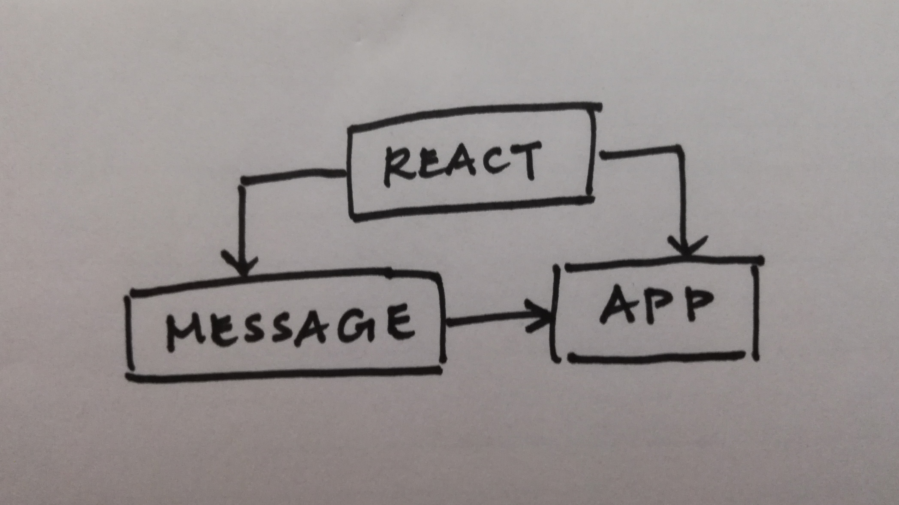
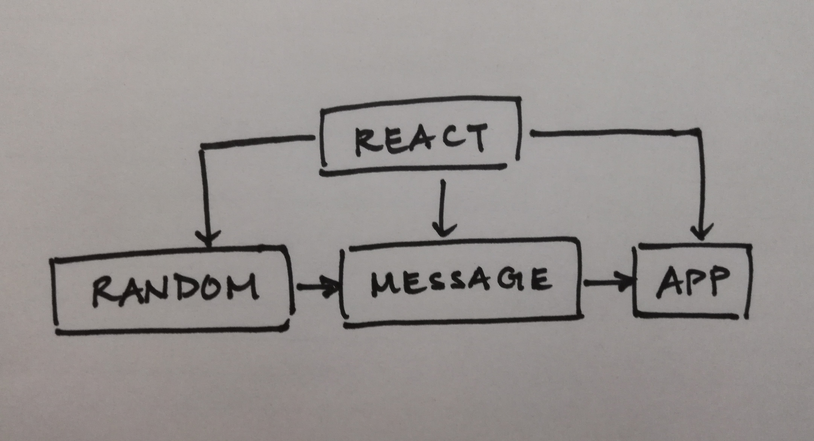
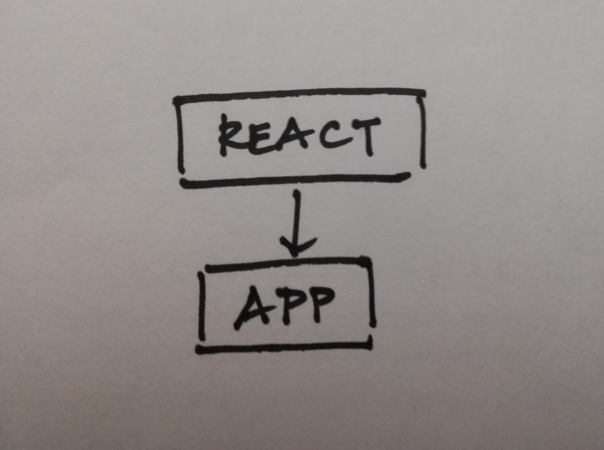
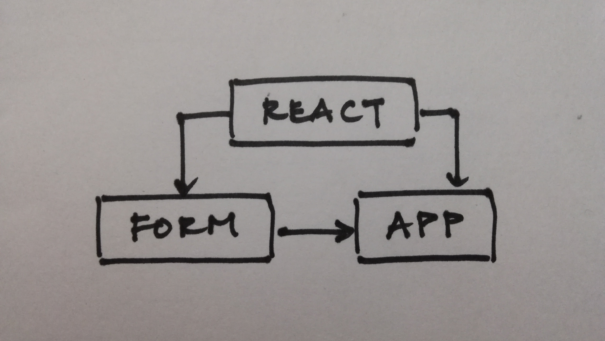

 LAB 28
=================================================

## Props and State

### Author: Katherine Smith

### Links and Resources
* [Assignment 1 - Props Practice (Part 1)](https://codesandbox.io/s/89my7pyk8)
* [Assignment 1 - Props Practice (Part 2)](https://codesandbox.io/s/k24r575rro)
* [Assignment 2 - Internal State Practice (Part 1)](https://codesandbox.io/s/72qv8yy62q)
* [Assignment 2 - Internal State Practice (Part 2)](https://codesandbox.io/s/jjqkj9qw2y)
* [Assignment 3 - External State Practice (Part 1)](https://codesandbox.io/s/65j4jnxv3)
* [Assignment 3 - External State Practice (Part 2)](https://codesandbox.io/s/vy3ovklo93)
---
### Assignment 1 - Props Practice (Part 1)
#### Message Component
- ##### Renders hello world text

#### App Component
- ##### Renders Message component

#### UML

---
### Assignment 1 - Props Practice (Part 2)
#### Random Component
- ##### Renders number between numbers text
- ##### Renders random number

#### Message Component
- ##### Renders hello world text
- ##### Renders hello school text
- ##### Renders hello name text
- ##### Renders Random component

#### App Component
- ##### Renders Message component

#### UML

---
### Assignment 2 - Internal State Practice (Part 1)
#### App Component
- ##### Renders input field for name
- ##### Renders submit button
- ##### Renders name
- ##### Renders number of updates

#### UML

---
### Assignment 2 - Internal State Practice (Part 2)
#### App Component
- ##### Renders input field for first name
- ##### Renders input field for last name
- ##### Renders submit button
- ##### Renders name
- ##### Renders number of updates

#### UML

---
### Assignment 3 - External State Practice (Part 1)
#### Form Component
- ##### Renders input field for name
- ##### Renders submit button

#### App Component
- ##### Renders Form component
- ##### Renders name
- ##### Renders number of updates

#### UML

---
### Assignment 3 - External State Practice (Part 2)
#### Form Component
- ##### Renders input field for first name
- ##### Renders input field for last name
- ##### Renders submit button

#### App Component
- ##### Renders Form component
- ##### Renders name
- ##### Renders number of updates

#### UML

---